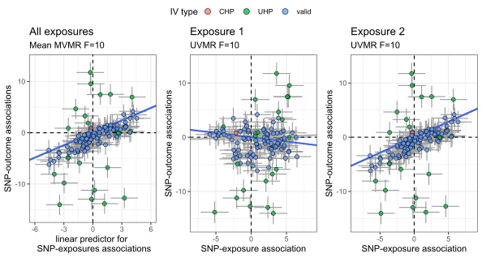

# How to use the simmrd package

The steps to generating and plotting data using the `simmrd` R package are:

1. Call `set_params()` to build a parameter list. Only specify the values you
   want to change — every argument has a sensible default.
2. Pass the list to `generate_summary()` or `generate_individual()`.
3. Optionally visualise the output with `plot_simdata()`.

## Using `generate_summary()`

```r
library(simmrd)

params <- set_params(
  sample_size_Xs             = 30000,
  sample_size_Y              = 30000,
  number_of_exposures        = 3,
  number_of_causal_SNPs      = 100,
  prop_gwas_overlap_Xs_and_Y = 1,
  number_of_CHP_causal_SNPs  = 20,
  ratio_of_CHP_variance      = 0.25,
  CHP_correlation            = -0.5,
  LD_causal_SNPs             = "ar1(0.5)",
  number_of_LD_blocks        = 3
)

gwas_data <- generate_summary(params)
```

## Using `generate_individual()`

```r
params <- set_params(
  type                       = "individual",
  sample_size_Xs             = 50000,
  sample_size_Y              = 50000,
  number_of_exposures        = 2,
  prop_gwas_overlap_Xs_and_Y = 0.5,
  Y_variance_explained_by_Xs = c(0, 0.5),
  signs_of_causal_effects    = c(1, 1),
  Xs_variance_explained_by_U = 0.12,
  Y_variance_explained_by_U  = 0.10,
  simtype                    = "weak",
  fix_Fstatistic_at          = 10
)

gwas_data <- generate_individual(params)
```

## Plotting simulated data

```r
plot_simdata(gwas_data, params)
```

Summary data:


Individual-level data:


