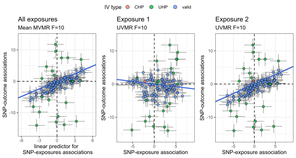

# How to use the simmr package

## General Steps
The steps to generating and plotting data using the `simmr` R package are the following:

1) Define a named list of parameters which are relevant to the type of simulated data you are generated. Call this list `params`. 
    - The lists of parameters depends on the type of simulated data you ultimately want to generate. If you want to first generate individual-level data then use it to generate GWAS summary statistics. See 2) for more details.
2) Give your list of parameters to either `generate_summary(params)` or `generate_individual(params)`.

## Using generate_summary()
Below is a named list of parameters to be used with the `generate_summary()` command. **The names of the parameters must not be changed. Change only the values assigned to each item**.
```r
summary_params=list(
  sample_size_Xs=30000, # exposure GWAS sample sizes
  sample_size_Y=30000, # outcome GWAS sample size
  prop_gwas_overlap_Xs_and_Y=1, # proportion of exposures' and outcome GWAS overlap
  number_of_exposures=3, # number of exposures
  number_of_causal_SNPs=100, # number of SNPs causing each exposure
  number_of_UHP_causal_SNPs=0, # number of UHP causal SNPs
  number_of_CHP_causal_SNPs=20, # number of CHP causal SNPs
  ratio_of_UHP_variance=0.15, # ratio of UHP variance to valid IV variance
  ratio_of_CHP_variance=0.25, # ratio of CHP variance to valid IV variance
  CHP_correlation=-0.5, # correlation between CHP and valid IV effect sizes
  simtype='winners', # performs IV selection based on P-value
  fix_Fstatistic_at=10, # ignored because simtype='winners'
  prop_gwas_overlap_Xs=1, # overlap of exposures' GWAS
  phenotypic_correlation_Xs=0.3, # phenotypic correlations between exposures
  genetic_correlation_Xs=0.15,  # genetic correlation between exposures
  phenotypic_correlations_Xs_and_Y=0.3, # phenotypic correlations b/w exposures and outcome
  true_causal_effects=0.3, # true causal effect sizes
  Xs_variance_explained_by_g=0.10, # exposure variance explained by SNPs
  LD_causal_SNPs='ar1(0.5)', # LD between causal exposure SNPs
  number_of_LD_blocks=3, # number of independent LD blocks
  MR_standardization='none', # does not standardize GWAS estimates
  MVMR_IV_selection_type='union', # SNPs associated with >0 exposures are candidate IVs
  IV_Pvalue_threshold=5e-8, # only SNPs with P<this threshold are candidate IVs
  LD_pruning_r2=1, # the upper LD r2 pruning threshold for candidate IVs
  N_of_LD_ref=Inf # the sample size of the LD reference panel
)
```
To generate simulated GWAS summary statistics using these parameters and assign the data to the object `summary_data`, execute the following in R:
```r
gwas_data=generate_summary(summary_params)
```

## Using generate_individual()
Below is a named list of parameters to be used with the `generate_individual()` command. **The names of the parameters must not be changed. Change only the values assigned to each item**.
```r
individual_params=list(
    sample_size_Xs=5e4, # exposure GWAS sample sizes
    sample_size_Y=5e4, # outcome GWAS sample size
    prop_gwas_overlap_Xs_and_Y=0.5, # proportion of exposure and outcome GWAS overlap
    number_of_exposures=2, # 4 number of exposures
    phenotypic_correlation_Xs=0.2, # phenotypic correlation between exposures
    genetic_correlation_Xs=0, # genetic correlation between exposures
    Xs_variance_explained_by_U=1/4-0.12, # exposures variance explained by confounder
    Y_variance_explained_by_Xs=c(0,0.5), # outcome variance explained by exposures
    signs_of_causal_effects=c(1,1), # signs of causal effects
    Y_variance_explained_by_U=0.1, # outcome variance explained by confounder
    number_of_causal_SNPs=200, # number of SNPs causing exposures
    mafs_of_causal_SNPs=stats::runif(100,0.1,0.5), # minor allele frequency of causal SNPs
    Xs_variance_explained_by_g=0.12, # exposures variance explained by SNPs 
    number_of_UHP_causal_SNPs=30, # number of UHP exposure SNPs
    number_of_CHP_causal_SNPs=10, # number of CHP exposure SNPs
    Y_variance_explained_by_UHP=0.05, # outcome variance explained by UHP SNPs
    U_variance_explained_by_CHP=0.05, # outcome variance explained by CHP SNPs
    LD_causal_SNPs='I', # independent causal exposure SNPs
    number_of_LD_blocks=1, # number of independent LD blocks
    MR_standardization='Z', # standardization of GWAS summary statistics 
    simtype='weak', # simulation performed using weak instruments
    MVMR_IV_selection_type='joint', # P-values for IV selection based on joint test for exposures
    IV_Pvalue_threshold=1, # P-value threshold for candidate IVs
    LD_pruning_r2=1, # upper boundary of squared LD correlation
    N_of_LD_ref=Inf, # size of the LD reference panel
    fix_Fstatistic_at=10 # average across exposures using full MVMR IV set
)
```
To generate simulated GWAS summary statistics using these parameters and assign the data to the object `summary_data`, execute the following in R:
```r
gwas_data=generate_individual(individual_params)
```
## Plotting simulated data
If you used `generate_summary()`, execute the following in R:
```r
plot_simdata(gwas_data,summary_params) 
```


If you used `generate_individual()`, execute the following in R:
```r
plot_simdata(gwas_data,individual_params)
```

