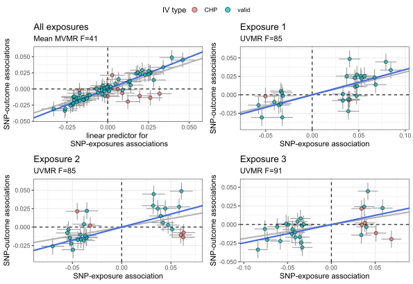

```{r, include = FALSE}
knitr::opts_chunk$set(
  collapse = TRUE,
  comment = "#>",
  fig.align = "center"
)
```

```{r setup, eval=FALSE}
library(simmrd)
```

## Overview

`simmrd` generates simulated GWAS data for evaluating Mendelian Randomization (MR)
methods under various conditions: weak instrument bias, GWAS sample overlap,
uncorrelated horizontal pleiotropy (UHP), and correlated horizontal pleiotropy (CHP).

The core workflow is:

1. Call `set_params()` to build a parameter list (only specify what you want to change).
2. Pass the list to `generate_summary()` or `generate_individual()`.
3. Optionally visualise with `plot_simdata()`.

## Quick start

```r
library(simmrd)

# one exposure, all defaults
params <- set_params()
data   <- generate_summary(params)

# two exposures with CHP, no GWAS overlap
params <- set_params(
  number_of_exposures        = 2,
  true_causal_effects        = c(0.3, 0.1),
  prop_gwas_overlap_Xs_and_Y = 0,
  number_of_CHP_causal_SNPs  = 20,
  ratio_of_CHP_variance      = 0.25,
  CHP_correlation            = -0.5
)
data <- generate_summary(params)
```

See `?set_params` for the full parameter list and defaults.

## Using `generate_summary()`

`generate_summary()` is the faster path and is suitable for most simulation studies.

```r
params <- set_params(
  sample_size_Xs             = 1e5,
  sample_size_Y              = 1e5,
  number_of_exposures        = 3,
  number_of_causal_SNPs      = 100,
  prop_gwas_overlap_Xs_and_Y = 1,
  number_of_CHP_causal_SNPs  = 20,
  ratio_of_CHP_variance      = 0.25,
  CHP_correlation            = -0.5,
  true_causal_effects        = 0.3,
  LD_causal_SNPs             = "ar1(0.5)",
  number_of_LD_blocks        = 3
)
data <- generate_summary(params)
```

## Using `generate_individual()`

`generate_individual()` builds individual-level genotype and phenotype data before
running GWAS, which is slower but lets you set confounding directly.

```r
params <- set_params(
  type                       = "individual",
  sample_size_Xs             = 5e4,
  sample_size_Y              = 5e4,
  number_of_exposures        = 2,
  prop_gwas_overlap_Xs_and_Y = 0.5,
  Y_variance_explained_by_Xs = c(0, 0.5),
  signs_of_causal_effects    = c(1, 1),
  Xs_variance_explained_by_U = 0.12,
  Y_variance_explained_by_U  = 0.10,
  simtype                    = "weak",
  fix_Fstatistic_at          = 10
)
data <- generate_individual(params)
```

## Built-in presets

`load_preset()` reproduces the named scenarios from the simmrd paper.
Use `list_presets()` to see all options.

```r
list_presets()

params <- load_preset("CHP", n = 1e5, snps = 100, exposures = 1, overlap = "none")
data   <- generate_summary(params)

# start from a preset and override one value
params <- load_preset("UHP_CHP", n = 1e5, snps = 500, exposures = 3, overlap = "full")
params$true_causal_effects <- c(0.1, 0.2, 0.3)
data <- generate_summary(params)
```

## Plotting simulated data

```r
plot_simdata(data, params)
```

For summary data:

```{r out.width='70%', echo=FALSE}

```

For individual-level data:

```{r out.width='70%', echo=FALSE}
knitr::include_graphics("img/p2.svg")
```

## Output

Both `generate_summary()` and `generate_individual()` return a named list.
The elements common to both are:

| Element | Description |
|---------|-------------|
| `bx` | m × p matrix of IV–exposure associations |
| `by` | m × 1 vector of IV–outcome associations |
| `bxse` / `byse` | Corresponding standard errors |
| `RhoME` | (p+1) × (p+1) measurement-error correlation matrix |
| `LDMatrix` | True LD correlation matrix among selected IVs |
| `LDhatMatrix` | Estimated LD correlation matrix among selected IVs |
| `theta` | True causal effects |
| `IVtype` | Per-IV label: `"valid"`, `"UHP"`, or `"CHP"` |
| `bx_unstd` / `by_unstd` | Unstandardised effect estimates |
| `bxse_unstd` / `byse_unstd` | Standard errors for unstandardised estimates |

`generate_summary()` additionally returns `beta_true`, `alpha_true`, `u`, `v`,
and `iv_index` — see `?generate_summary` for details.
